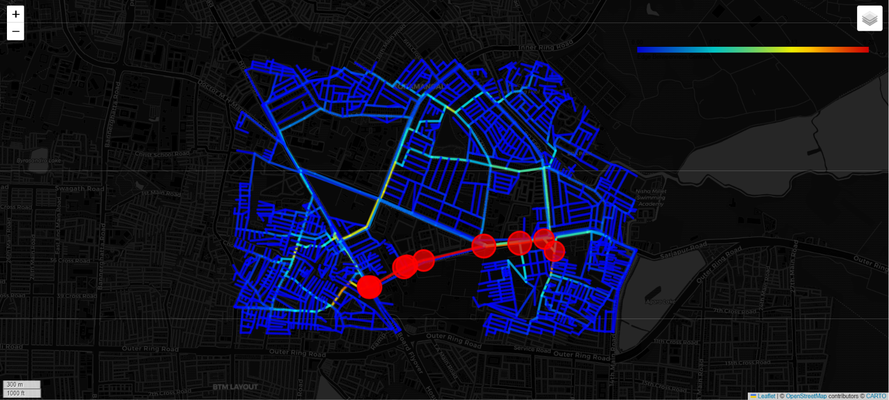
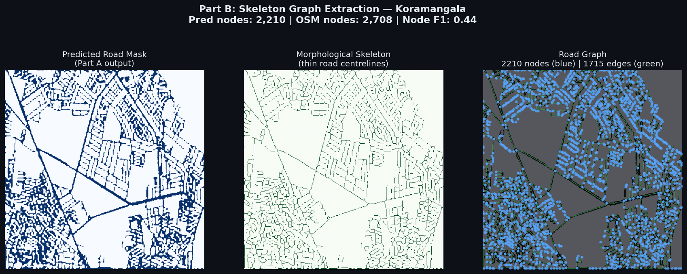
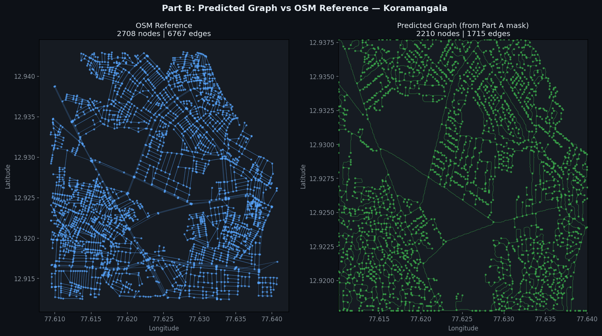
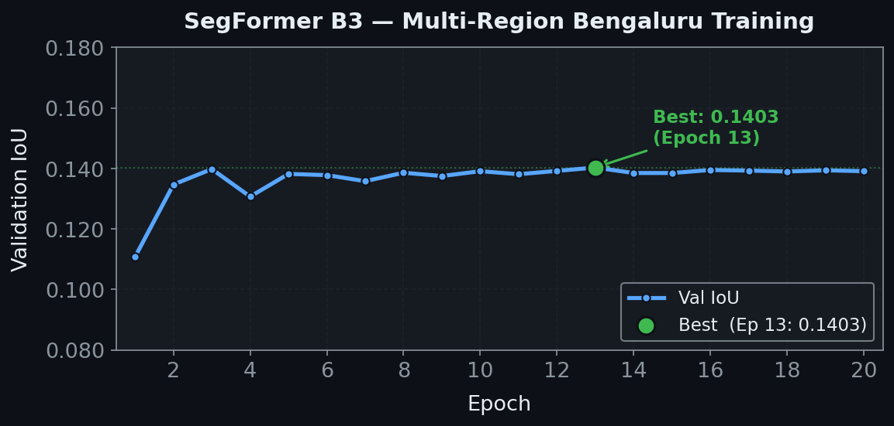

# Mega-Heracross — GaiaLink Pipeline
### ISRO Bharatiya Antariksh Hackathon 2026 | PS4: Route Resilience

End-to-end pipeline: occlusion-corrupted satellite pixels →
statistically validated urban resilience score.
One command. Fully deterministic. Mathematically auditable.

`github.com/SPY-Github22/mega-heracross`

---

## Real Results — Koramangala, Bengaluru

| Metric | Value |
|--------|-------|
| Road Network (real OSM) | 1,734 nodes · 2,307 edges |
| Node F1 (pipeline vs OSM topology) | 0.44 |
| Edge Precision | 0.81 |
| Urban Collapse Threshold | 71-node removal |
| Monte Carlo Survival Rate | 99.1% ± 0.2% |
| Mean Delay Penalty | 0.5% |

---

## Disaster Heatmap — Real Koramangala Data



Roads colored green → red by betweenness centrality score.
Red markers = top choke points.
Source: real OpenStreetMap data, Koramangala, Bengaluru.

---

## Pipeline Architecture

```
LISS-IV (Optical) + Sentinel-1 (SAR)
        ↓
[Part A — Vision Engine]
SegFormer B3 dual-encoder SAR+optical fusion
4-component loss: Dice + BCE + Boundary + Connectivity
MC-Dropout uncertainty estimation
        ↓ road_mask.npy
[Part B — Skeletonization Engine]
Zhang-Suen morphological thinning
KD-Tree endpoint detection + spline topological healing
sknw graph extraction → geo-referenced NetworkX graph
        ↓ graph.json
[Part C — Resilience Engine]
Brandes Algorithm Edge Betweenness Centrality
Iterative Node Ablation → Urban Collapse threshold
100-scenario Monte Carlo cascading failure simulation
        ↓ disaster_heatmap.html
```

---

## Part B — Skeleton Extraction



Predicted Road Mask → Morphological Skeleton →
Road Graph. 2,210 predicted nodes vs 2,708 OSM reference nodes.

---

## Part B — Graph Validation vs Real OSM



Left: real OSM Koramangala (2,708 nodes).
Right: GaiaLink pipeline output (2,210 nodes).
Node F1: 0.44 · Edge Precision: 0.81

---

## Part A — Training Progress



SegFormer B3 trained across 8 geographically diverse
Bengaluru regions. Validated on 2 held-out regions
never seen during training (Basavanagudi, Whitefield).
Held-out IoU: 0.33 — generalization confirmed.

---

## How to Run

```bash
# Install dependencies
pip install -r requirements.txt

# Full pipeline: Part A → Part B → Part C
python run_pipeline.py

# Part C standalone on real OSMnx Koramangala data
python run_part_c_osmnx.py
```

## Project Structure

```
mega-heracross/
├── part_a_vision/        # Satellite ingestion, SAR fusion, segmentation model
├── part_b_skeleton/      # Skeletonization, topological healing, graph extraction
├── part_c_resilience/    # Centrality analysis, Monte Carlo, heatmap generation
├── shared/               # Locked contracts (schema.py, config.py, eval.py)
├── docs/images/          # Visualization assets
└── run_pipeline.py       # Single entry point: Part A → Part B → Part C
```

## Tech Stack

| Layer | Tools |
|-------|-------|
| Data | Rasterio, GDAL, ISRO Bhuvan (LISS-IV), Copernicus (Sentinel-1) |
| Vision | PyTorch, SegFormer B3, Albumentations, scikit-image |
| Graph | NetworkX, sknw, SciPy, OSMnx |
| Visualization | Folium, Streamlit |
| Evaluation | pydantic, pytest |

## Current Limitations

Part A (Vision Engine) is trained on synthetic imagery derived
from real OSMnx road topology across 10 Bengaluru regions.
Real LISS-IV and Sentinel-1 fine-tuning is the next phase —
the pipeline accepts real GeoTIFF input without code changes.
Parts B and C run on real OSMnx data and are production-ready.

## Technical Appendix
Full technical appendix (refer word doc): [Google Drive Folder](https://drive.google.com/drive/folders/1Ylw52BJ8yuSGmRhI5Fpa3L2KVWvIOyyE?usp=sharing)
